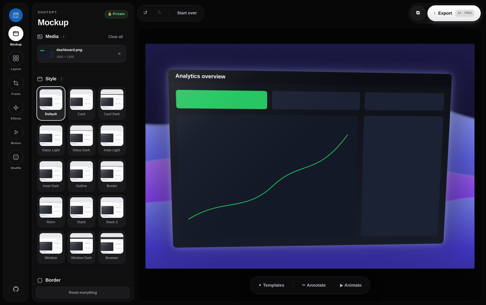

<div align="center">

# ShotOpt

**Turn plain screenshots into polished images and motion mockups — entirely in your browser.**

[](LICENSE)
[](https://github.com/LiamFallen/ShotOpt/actions/workflows/ci.yml)
[](#how-it-works)
[](CONTRIBUTING.md)



</div>

ShotOpt is a free, open-source screenshot beautifier and mockup studio. Drop
in a screenshot, pick a template, and export a still, a WebM video, or a
looping GIF — with backgrounds, 3D perspective, scenes, VFX, and annotations.

**Nothing ever leaves your browser.** There is no backend, no analytics, no
accounts, and no third-party requests of any kind. The
`Content-Security-Policy` in `_headers` locks the page to same-origin, so the
privacy claim is enforced by the browser rather than just promised.

## Features

- Drag-and-drop, paste (⌘V) or file-pick — up to 3 images at once
- 15 mockup styles: Card, Glass, Inset, Outline, Retro, Stack, macOS Window, Browser…
- **Annotate mode**: arrows, lines, rectangles, ellipses, freehand pen and
  text labels in five colours and three weights — undoable, saved with your
  settings, and rendered into every export including video and GIF
- 150+ backgrounds across 10 categories, plus custom colour, your own image,
  transparent, and **Magic** (a palette derived from your screenshot)
- 26 one-click **templates** (product promo, UI showcase, minimal, abstract),
  including animated ones — thumbnails preview your own screenshot live
- **Motion**: 11 animation presets (push, pan, sweep, showcase orbit, float,
  reveal, swing, drift…) with live preview, smoothly-tweened layout changes,
  and in-browser **WebM video and looping GIF export** — the GIF encoder is
  written from scratch inside the app, no libraries
- **VFX**: Cinematic (teal & orange + letterbox), VHS, Noir, Vintage, Dream,
  Duotone (tinted from your background) and Frost — all GPU-accelerated, with
  an intensity dial
- **Scenes**: floor, glow, glossy 3-D spheres, blobs, prisms, clouds, bokeh,
  light rays, confetti and a podium with perspective grid — props take their
  colours from the background and cast soft shadows that follow the global
  light angle
- 8 shadow types with opacity, size, light angle and distance
- GPU-accelerated perspective: tilt X/Y, rotate, zoom, offset
- Direct manipulation: drag the image to move it, grab a corner chip to
  resize, nudge with arrow keys
- 12 layout presets with live thumbnails and glide transitions
- Visual canvas-size picker — 23 sizes including LinkedIn, X, Open Graph,
  Instagram and Story presets, each drawn at its true aspect ratio
- Grain, vignette, one-click background blur, text **or logo** watermark
- Up to 4× export in PNG, JPG or WEBP at high encoder quality
- Undo/redo, settings persistence, installable as a PWA, works fully offline

## Quick start

No build step, no dependencies, no package manager:

```bash
git clone https://github.com/LiamFallen/ShotOpt.git
cd ShotOpt
python3 -m http.server 8787     # or: npx serve, php -S, caddy file-server…
```

Open `http://127.0.0.1:8787`. You can also just double-click `index.html` —
everything works except the service worker and copy-to-clipboard, which
require a secure context (`https://` or `localhost`).

## Host your own

ShotOpt is six static files — it deploys anywhere in about a minute, free:

| Host | How |
| --- | --- |
| **Cloudflare Pages** | Connect the repo · framework preset **None** · build command *empty* · output dir `/`. The `_headers` file is applied automatically. |
| **Netlify** | Same: no build command, publish dir `/`. Netlify also reads `_headers`. |
| **GitHub Pages** | Settings → Pages → deploy from `main`. Works, but Pages can't serve `_headers`, so the CSP isn't enforced there — fine for personal use. |
| **Anything else** | Serve the repo root as static files. Mirror the CSP from `_headers` in your server config if you can. |

After deploying a change, bump `CACHE` in `sw.js` so returning visitors drop
the old cached copy.

## How it works

The entire app is **one hand-written `index.html`** (~3k lines): the
background library, the 3D projection, the WebGL perspective renderer with a
CPU fallback, the shadow compositor, the GIF89a encoder, the motion engine —
all of it, with zero dependencies. That's a deliberate constraint, not an
accident:

- **Auditable** — you can read everything the app does in one file, which is
  what makes the "nothing leaves your browser" promise checkable.
- **Durable** — no dependency churn, no build toolchain to rot; it will still
  run untouched in a decade.
- **Forkable** — copy one file and you have the whole app.

See [CONTRIBUTING.md](CONTRIBUTING.md) for the architecture tour and the
project's three rules.

| File | Purpose |
| --- | --- |
| `index.html` | The entire app — markup, styles and logic in one file |
| `sw.js` | Service worker: offline shell cache, network-first for updates |
| `_headers` | Security (CSP) and caching rules, applied by Cloudflare/Netlify |
| `manifest.webmanifest` | PWA metadata so it can be installed |
| `icon.svg` / `og.jpg` | App icon and social preview card |
| `tests/smoke.mjs` | Playwright smoke test, run by CI on every PR |

## Browser support

Chrome, Edge, Safari and Firefox (current versions). Perspective uses WebGL
where available and falls back to a CPU renderer otherwise; video export
needs `MediaRecorder` (everywhere except very old Safari), and GIF export
works everywhere.

## Contributing

Issues and PRs are very welcome — from a single new background gradient to a
whole new scene. Start with [CONTRIBUTING.md](CONTRIBUTING.md); the
[good first issue](https://github.com/LiamFallen/ShotOpt/labels/good%20first%20issue)
label is kept stocked with self-contained ideas. Please also read the
[Code of Conduct](CODE_OF_CONDUCT.md).

Security reports: see [SECURITY.md](SECURITY.md).

## License

[MIT](LICENSE) — free to use, copy, modify, and redistribute, including
commercially. If you ship a fork, a link back is appreciated but not
required.
